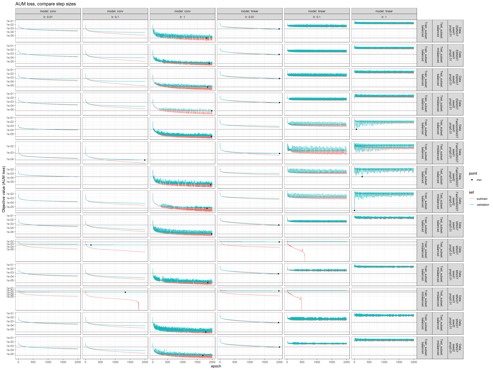
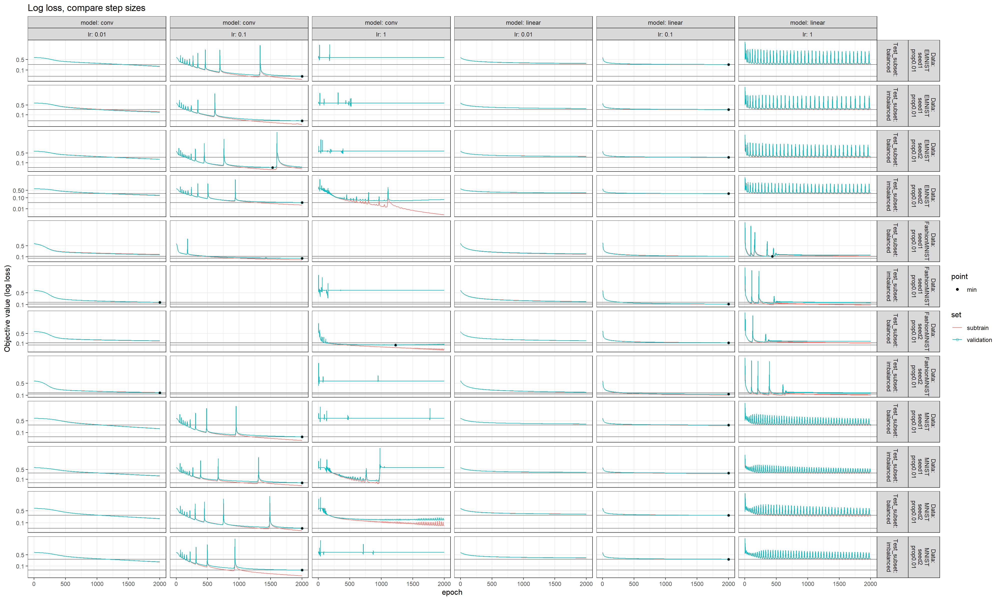
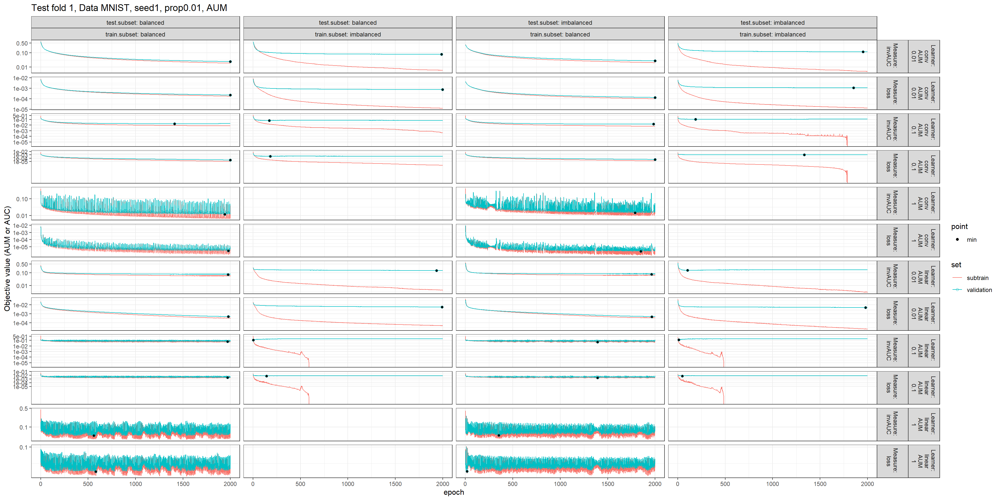
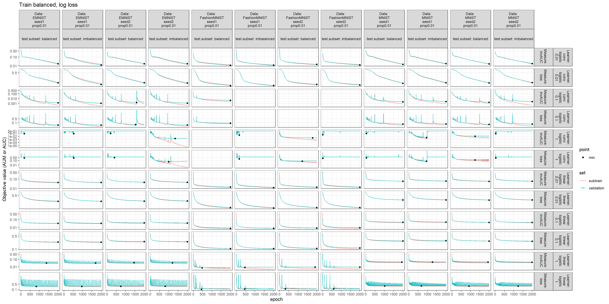
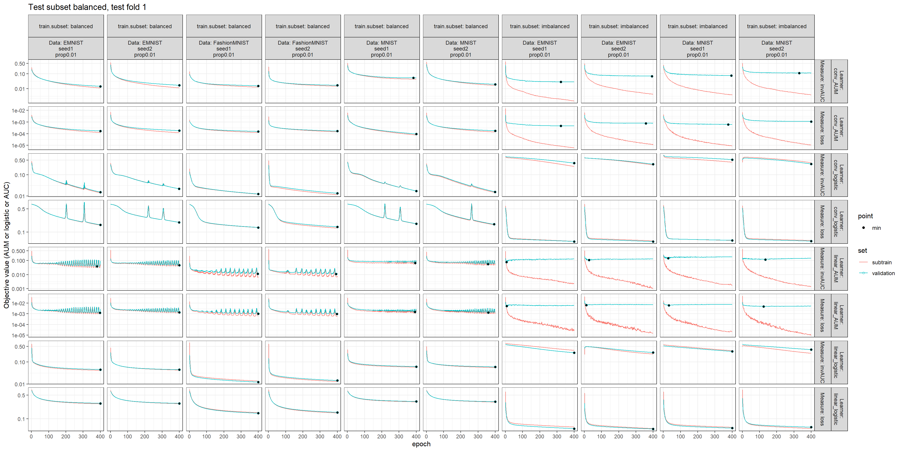
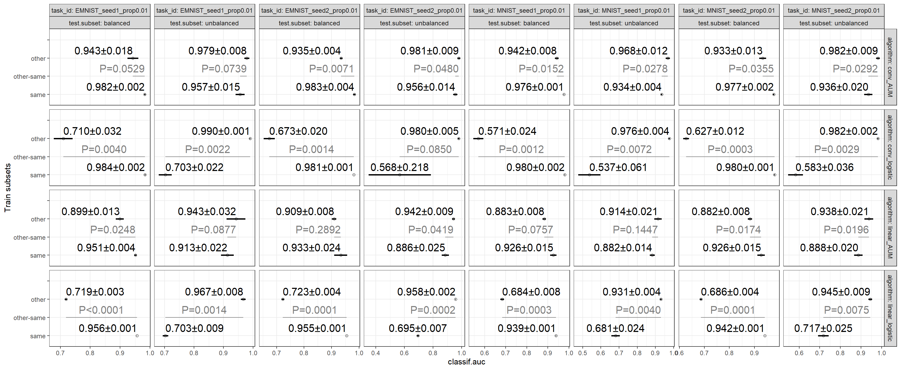

Paper comparing algorithms for imbalanced classification (in progress)

** 29 July 2025

[[file:2025-07-24-conv-linear-prop0.01.R]] launches an
imbalanced SOK experiment on the cluster (beluga),
with

- conv and linear models,
- learning rate (lr) in 0.01, 0.1, 1
- train and test in balanced or imbalanced

[[file:2025-07-24-conv-linear-prop0.01/figure-results.R]] generates result figures

- subtrain AUM goes to zero for linear model on train imbalanced MNIST.
- imbalanced train missing for conv model.
- number of epochs still too small (for full batch size).
- min conv loss much smaller than min linear loss.

- compare with MNIST batch size 100 log loss [[https://tdhock.github.io/blog/2025/mlr3torch-conv/][result blog]].
- best models at lr=0.1, number of epochs too small.
- conv loss smaller than linear.

- AUM and AUC subtrain values are very similar.
- Some differences between validation curves.

** 24 July 2025

[[file:2025-07-22-conv-linear-prop0.01.R]] launches an
imbalanced SOK experiment on the cluster (beluga), generating result files

- [[file:2025-07-22-conv-linear-prop0.01/results.csv]] contains test AUC.
- [[file:2025-07-22-conv-linear-prop0.01/learners.csv.gz]] contains subtrain/validation loss/AUC/etc.

Then [[file:2025-07-22-conv-linear-prop0.01/figure-results.R]] creates the following two result figures:

The figure above shows the following trends (for 1% positive labels, learning rate 0.05).

- train=balanced: not enough epochs. learning rate too big for linear AUM and conv logistic.
- train=imbalanced: linear AUM min valid at <200 epochs (OK). conv AUM need more epochs. variation between seeds for min valid AUC. logistic very slow.
- Suggest: increase number of epochs, and try increase and decrease learning rate.

